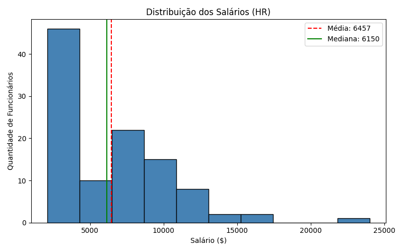
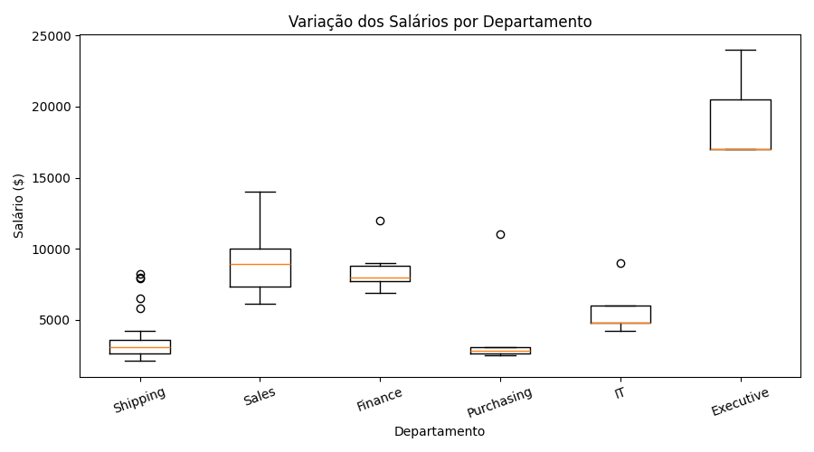
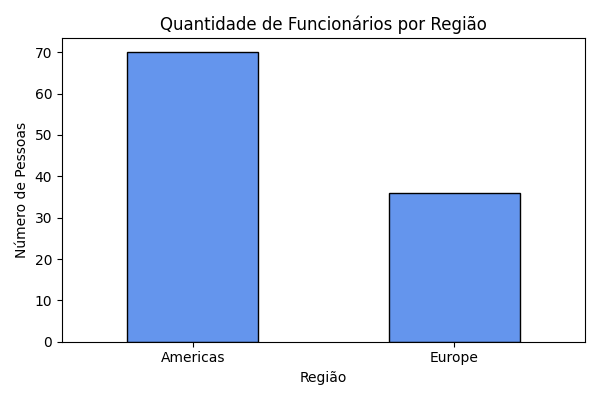

# Análise de Recursos Humanos — Base HR (FreeSQL)

**Disciplina:** Visualização de Dados e Business Intelligence [T3] <br>
**Instituição:** SENAI / SCTEC — Módulo 1 <br>
**Aluno:** Dilsonei José Rigotti <br>
**Orientadora:** Cibelle Maciel <br>
**Turma:** Carreira Tech - Trilha Análise de Dados - SCTEC / SENAI <br>

---

## 1. Objetivo do Trabalho

Este projeto tem como objetivo realizar uma análise exploratória de dados de Recursos Humanos utilizando o banco de dados **FreeSQL** (esquema **HR**). 

Atuando como analista de dados júnior em uma rotina prática de trabalho, o estudo busca responder a questões estratégicas de gestão de pessoas:
1. Como os salários variam entre departamentos e cargos na organização?
2. Como a força de trabalho e a remuneração estão distribuídas regional e geograficamente?
3. Qual é o comportamento da distribuição salarial (comparação entre média e mediana)?
4. Quais insights e recomendações podem ser extraídos para a tomada de decisão da equipe de RH, atentando-se para as limitações?

---

## 2. Tabelas Utilizadas (Esquema HR)

As tabelas do esquema HR utilizadas e suas respectivas funções na análise:

| Tabela | Função / Conteúdo |
|---|---|
| `HR.EMPLOYEES` | Tabela fato/central com cadastro dos colaboradores: identificador, nome, salário, departamento e cargo. |
| `HR.DEPARTMENTS` | Identificação e nome dos departamentos (`DEPARTMENT_NAME`), além do vínculo com localização. |
| `HR.JOBS` | Título dos cargos (`JOB_TITLE`) e faixas salariais pré-estabelecidas (`MIN_SALARY` e `MAX_SALARY`). |
| `HR.LOCATIONS` | Endereço, cidade (`CITY`) e estado/província (`STATE_PROVINCE`) das unidades da empresa. |
| `HR.COUNTRIES` | Mapeamento dos países (`COUNTRY_NAME`) onde as unidades operam. |
| `HR.REGIONS` | Regiões continentais (`REGION_NAME`) que agrupam os países (ex.: Americas, Europe). |

---

## 3. Consultas SQL Desenvolvidas

Foram desenvolvidas duas consultas no padrão SQL da Oracle (FreeSQL), ambas aplicando `LEFT JOIN` e filtros com cláusula `WHERE` simples:

### 🔹 Consulta 1: Salários por Departamento e Cargo (`sql/query_1.sql`)
- **Objetivo:** Relacionar cada funcionário ao seu departamento e cargo, permitindo avaliar a dispersão salarial dentro de cada área.
- **Relacionamentos:** `HR.EMPLOYEES` com `LEFT JOIN` em `HR.DEPARTMENTS` e `HR.JOBS`.
- **Filtro Aplicado:** `WHERE e.DEPARTMENT_ID IS NOT NULL` (assegura que colaboradores em transição sem departamento alocado não distorçam as análises departamentais).

```sql
SELECT 
    e.EMPLOYEE_ID,
    e.FIRST_NAME,
    e.LAST_NAME,
    e.SALARY,
    d.DEPARTMENT_ID,
    d.DEPARTMENT_NAME,
    j.JOB_ID,
    j.JOB_TITLE,
    j.MIN_SALARY,
    j.MAX_SALARY
FROM HR.EMPLOYEES e
LEFT JOIN HR.DEPARTMENTS d 
    ON e.DEPARTMENT_ID = d.DEPARTMENT_ID
LEFT JOIN HR.JOBS j 
    ON e.JOB_ID = j.JOB_ID
WHERE e.DEPARTMENT_ID IS NOT NULL
ORDER BY e.SALARY DESC;
```

### 🔹 Consulta 2: Funcionários por Região e Localização (`sql/query_2.sql`)
- **Objetivo:** Mapear a força de trabalho geograficamente, identificando cidade, estado, país e região continental.
- **Relacionamentos:** `HR.EMPLOYEES` com `LEFT JOIN` em `DEPARTMENTS`, `LOCATIONS`, `COUNTRIES` e `REGIONS`.
- **Filtro Aplicado:** `WHERE r.REGION_NAME IS NOT NULL` (garante a consistência dos registros associados a uma região válida).

```sql
SELECT 
    e.EMPLOYEE_ID,
    e.FIRST_NAME,
    e.LAST_NAME,
    e.SALARY,
    d.DEPARTMENT_NAME,
    l.CITY,
    l.STATE_PROVINCE,
    c.COUNTRY_NAME,
    r.REGION_NAME
FROM HR.EMPLOYEES e
LEFT JOIN HR.DEPARTMENTS d 
    ON e.DEPARTMENT_ID = d.DEPARTMENT_ID
LEFT JOIN HR.LOCATIONS l 
    ON d.LOCATION_ID = l.LOCATION_ID
LEFT JOIN HR.COUNTRIES c 
    ON l.COUNTRY_ID = c.COUNTRY_ID
LEFT JOIN HR.REGIONS r 
    ON c.REGION_ID = r.REGION_ID
WHERE r.REGION_NAME IS NOT NULL
ORDER BY r.REGION_NAME, e.SALARY DESC;
```

---

## 4. Estrutura de Arquivos e Dados Extraídos

```
├── CSV/
│   ├── query_01.csv          # 106 registros de salários, departamentos e cargos
│   └── query_02.csv          # 106 registros de funcionários com dados de localização
├── sql/
│   ├── query_1.sql           # Script da consulta 1
│   └── query_2.sql           # Script da consulta 2
├── analise/
│   ├── analise.py            # Script Python de análise exploratória e gráficos
│   └── graficos/
│       ├── histograma_salarios.png
│       ├── boxplot_salarios.png
│       └── funcionarios_por_regiao.png
├── notebooks/
│   └── analise_exploratoria_hr.ipynb  # Relatório interativo em Jupyter Notebook
├── README.md                 # Documentação completa
└── requirements.txt          # Dependências do projeto (pandas, matplotlib, seaborn, ipykernel)
```

---

## 5. Análise Exploratória de Dados (Python / EDA)

A análise foi conduzida via script Python utilizando as bibliotecas `pandas` e `matplotlib`.

### 5.1 Medidas Estatísticas Gerais de Salário

| Métrica Estatística | Valor |
|---|---|
| **Total de Registros Analisados** | 106 colaboradores |
| **Média Salarial** | **$ 6.456,75** |
| **Mediana Salarial** | **$ 6.150,00** |
| **Salário Mínimo** | **$ 2.100,00** |
| **Salário Máximo** | **$ 24.000,00** |
| **Desvio Padrão** | **$ 3.927,80** |

> **Relação Média x Mediana:** A média ($ 6.456,75) é ligeiramente superior à mediana ($ 6.150,00), com diferença de cerca de $ 306,75. Isso indica uma leve **assimetria à direita (positiva)** na distribuição, explicada pelo salário do Presidente ($ 24.000,00) e da Vice-Presidência ($ 17.000,00), que elevam a média geral.

### 5.2 Comparativo por Departamento

| Departamento | Qtd. Funcionários | Média Salarial ($) | Mediana ($) | Mínimo ($) | Máximo ($) |
|---|:---:|:---:|:---:|:---:|:---:|
| **Executive** | 3 | 19.333,33 | 17.000,00 | 17.000,00 | 24.000,00 |
| **Accounting** | 2 | 10.154,00 | 10.154,00 | 8.300,00 | 12.008,00 |
| **Public Relations** | 1 | 10.000,00 | 10.000,00 | 10.000,00 | 10.000,00 |
| **Marketing** | 2 | 9.500,00 | 9.500,00 | 6.000,00 | 13.000,00 |
| **Sales** | 34 | 8.955,88 | 8.900,00 | 6.100,00 | 14.000,00 |
| **Finance** | 6 | 8.601,33 | 8.000,00 | 6.900,00 | 12.008,00 |
| **Human Resources** | 1 | 6.500,00 | 6.500,00 | 6.500,00 | 6.500,00 |
| **IT** | 5 | 5.760,00 | 4.800,00 | 4.200,00 | 9.000,00 |
| **Administration** | 1 | 4.400,00 | 4.400,00 | 4.400,00 | 4.400,00 |
| **Purchasing** | 6 | 4.150,00 | 2.850,00 | 2.500,00 | 11.000,00 |
| **Shipping** | 45 | 3.475,56 | 3.100,00 | 2.100,00 | 8.200,00 |

### 5.3 Comparativo por Região Geográfica

| Região | Funcionários | % do Total | Média Salarial ($) | Mediana ($) | Faixa Salarial |
|---|:---:|:---:|:---:|:---:|:---:|
| **Americas** | 70 | 66,0% | $ 5.191,66 | $ 3.300,00 | $ 2.100 a $ 24.000 |
| **Europe** | 36 | 34,0% | $ 8.916,67 | $ 8.900,00 | $ 6.100 a $ 14.000 |

- Na **região Americas**, há grande disparidade: a mediana é de apenas $ 3.300,00 devido à concentração do time operacional de logística (*Shipping*), enquanto a média sobe para $ 5.191,66 pelos cargos executivos de Seattle.
- Na **Europa**, todos os 36 colaboradores pertencem ao departamento de *Sales* (Reino Unido), apresentando um padrão salarial mais homogêneo e elevado (mediana de $ 8.900,00).

---

## 6. Visualizações Gráficas

### 🔹 Gráfico 1: Histograma da Distribuição Salarial
Mostra a frequência de colaboradores por faixa de salário, evidenciando o ponto central e a concentração da maior parte dos trabalhadores na faixa inicial (entre $ 2.000 e $ 4.000).



### 🔹 Gráfico 2: Boxplot por Departamento
Demonstra a dispersão, a amplitude interquartil e os salários atípicos (outliers) dos principais departamentos da empresa.



### 🔹 Gráfico 3: Distribuição de Funcionários por Região
Exibe a divisão de força de trabalho entre as Américas e a Europa.



---

## 7. Principais Resultados e Insights de RH

1. **Alta concentração salarial em funções operacionais:** Mais de 42% de todo o quadro da empresa está alocado no setor de *Shipping* (logística/expedição), com média salarial em torno de $ 3.475,00.
2. **Disparidade entre unidades geográficas:** A filial europeia apresenta uma remuneração média 71% superior à americana, não por política discriminatória, mas pela natureza funcional dos escritórios (a Europa concentra a força comercial/vendas, enquanto as Américas abrigam a fábrica/logística e a diretoria).
3. **Limitação para tomada de decisão:** A amostra da base HR não contempla tempo de casa, horas extras, comissões variáveis efetivamente pagas no mês e custo de vida de cada país. Qualquer política salarial deve considerar esses fatores externos antes de ajustes de piso ou plano de carreira.

---

## 8. Como Executar o Projeto

### Pré-requisitos
- Python instalado (versão 3.10 ou superior)
- Git para versionamento de código

### Passo a passo
1. Clone o repositório ou baixe os arquivos:
   ```bash
   git clone https://github.com/dilsoneir-dev/Projeto-avaliativo-modulo1-SCTEC.git
   cd "Projeto Avaliativo - Módulo 1"
   ```

2. Instale as dependências:
   ```bash
   pip install -r requirements.txt
   ```

3. Execute a análise (via Script Python ou Jupyter Notebook):
   - **Via Script:**
     ```bash
     python analise/analise.py
     ```
   - **Via Jupyter Notebook:**
     Abra e execute o arquivo `notebooks/analise_exploratoria_hr.ipynb` diretamente no VS Code ou via navegador.

4. Os gráficos atualizados serão salvos automaticamente na pasta `analise/graficos/`.

---

## 09. Link da Apresentação em Vídeo (Até 7 minutos)

- **Link do Vídeo:** (https://youtu.be/i9kbaM3-xlE)

